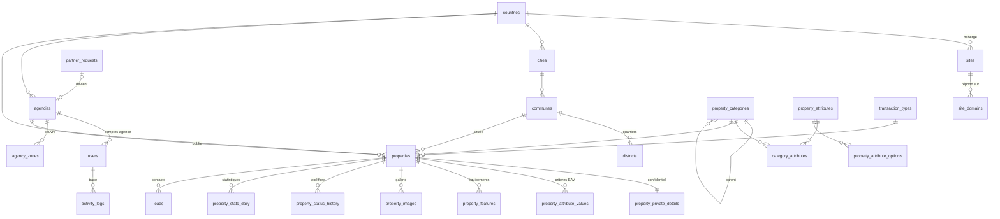

# Base de données — immobilier.abidjan.net

Fichiers : `database/schema.sql` (structure de référence v1) · `database/seed.sql` (référentiels de lancement Côte d'Ivoire).
Cible : **MySQL 8.0+ / MariaDB 10.6+**, InnoDB, `utf8mb4_unicode_ci` (collation portable MySQL ↔ MariaDB). Testé sur MySQL 8.0.40 (MAMP).

## Vue d'ensemble (37 tables)

| Domaine | Tables |
|---|---|
| Multisite & géographie | `countries`, `sites`, `site_domains`, `cities`, `communes`, `districts`, `settings` |
| Agences & comptes | `agencies`, `agency_zones`, `users`, `login_attempts`, `password_resets`, `remember_tokens` |
| Catalogue | `transaction_types`, `property_categories`, `category_transaction_types`, `attribute_groups`, `property_attributes`, `property_attribute_options`, `category_attributes`, `features` |
| Annonces | `properties`, `property_private_details`, `property_attribute_values`, `property_features`, `property_images`, `property_status_history`, `property_stats_daily` |
| Relation client | `leads`, `partner_requests`, `notifications` |
| Contenu & SEO | `pages`, `blog_posts`, `banners`, `seo_meta`, `redirects` |
| Traçabilité | `activity_logs` |

## Relations principales



## Choix de conception

1. **Une seule table `users`** pour l'équipe interne et les agences (le cahier évoquait `admin_users` et `agency_users`). Raisons : connexion unique à `/cmsadmin`, unicité des emails garantie par la base, journal et notifications reliés à un seul type de compte. La contrainte `chk_users_scope` impose la cohérence rôle ↔ pays ↔ agence (un Admin Pays a un pays, un compte agence a une agence).
2. **Rôles** : `super_admin`, `country_admin`, `agency_owner` (responsable de l'agence : profil, agents), `agency_agent`. Les permissions sont définies dans le code par rôle ; une table de permissions fines pourra être ajoutée si le besoin apparaît.
3. **Critères dynamiques — EAV hybride.**
   - Les critères sont décrits dans `property_attributes` et rattachés aux catégories via `category_attributes` (une sous-catégorie hérite des critères de sa racine et peut en ajouter). Tout se paramètre depuis le back-office.
   - Les critères **les plus filtrés** (surface habitable, superficie terrain, pièces, chambres, salles de bain) sont stockés dans des **colonnes indexées** de `properties` (`storage = 'column'`) : la recherche reste rapide sans jointures EAV. Les autres (standing, titre de propriété, viabilisation…) vont dans `property_attribute_values`.
   - Un critère à choix multiple produit une ligne par option (unicité garantie par `option_scope`).
4. **Données confidentielles isolées** dans `property_private_details` (propriétaire d'un bien de particulier, notaire, référence de dossier, notes). Les requêtes du site public ne joignent jamais cette table.
5. **Deux statuts distincts** sur une annonce : `status` (workflow de publication : `pending`, `published`, `rejected`, `unpublished`, `archived`, `expired`) et `availability` (disponibilité du bien : disponible, réservé, vendu, loué). Un rejet sans motif est refusé par la base. Chaque changement de statut est historisé dans `property_status_history`.
6. **Origine d'une annonce** (`source`) : `agency` (agence partenaire, `agency_id` obligatoire), `private_owner` (bien de particulier publié par l'admin), `platform` (bien propre).
7. **Multisite** : `site_domains` associe chaque nom d'hôte (production, staging, local) à un site ; le middleware `SiteResolver` retire le port de `HTTP_HOST` avant la recherche. Toutes les tables métier portent `country_id`.
8. **Paramètres** : `settings` avec `site_id` NULL = valeur globale, sinon surcharge par site. Les décisions métier en attente (taux et mode de commission, contacts du site) sont initialisées à `null`.
9. **Multilingue prêt** : libellés de référentiels en français + colonne JSON `*_translations` (`{"en": "…"}`) ; les chaînes d'interface restent dans `lang/*.php`.
10. **Prix** : `DECIMAL(15,2)` + `currency_code` copié du pays à la création (FCFA sans décimales, autres devises possibles). `price` NULL = prix sur demande ; `price_period` = total, mois, semaine, nuit, année.
11. **Statistiques** : compteurs dénormalisés sur `properties` (`views_count`, `leads_count`) + agrégats journaliers `property_stats_daily` (vues, clics téléphone / WhatsApp, partages, contacts) pour les graphiques des tableaux de bord.
12. **Hero de l'accueil** : diapositives gérées dans `banners` avec `placement = 'home_hero'` (titre, légende du lieu, image).
13. **Suppression logique** (`deleted_at`) sur `users`, `agencies`, `properties` ; les autres tables utilisent des statuts ou la suppression physique avec cascades.

## Écarts avec la liste du cahier des charges (§3)

| Cahier | Choix retenu | Motif |
|---|---|---|
| Catégorie « Terrain loti / non loti » | Critère `land_subdivision` (Loti / Non loti) sur toutes les catégories Terrains | C'est un état du terrain, pas un type : évite de dupliquer terrain nu loti / non loti, agricole loti… |
| « Bail commercial / cession de bail » | Deux types de transaction distincts | Une cession de bail se vend (prix total), un bail se loue (loyer mensuel) |
| « Terrain à vendre / à louer » | Transactions Vente / Location sur la catégorie Terrains | Même logique que les autres biens |
| Équipements et critères résidentiels | Piscine, jardin, garage, climatisation, sécurité, groupe électrogène, forage, ascenseur, fibre → `features` ; surfaces, pièces, étage, standing… → critères | Les équipements sont des cases à cocher filtrables communes à plusieurs catégories |

## Conventions

- Tables au pluriel en `snake_case`, clés étrangères `<entité>_id`, index `idx_<table>_<usage>`, uniques `uq_…`, contraintes `chk_…`, clés étrangères `fk_…`.
- Identifiants `INT UNSIGNED` (référentiels) ou `BIGINT UNSIGNED` (volumes : annonces, valeurs, images, contacts, journaux).
- Dates en **UTC** (`DATETIME`), conversion au fuseau du pays à l'affichage. IP en `VARBINARY(16)` via `INET6_ATON()` / `INET6_NTOA()`.
- Aucun compte ni mot de passe dans `seed.sql` : le premier Super Admin est créé par le script d'installation (lot 1.3).

## Évolutions du schéma

`schema.sql` est l'**état de référence v1**. Toute modification ultérieure :
1. nouveau fichier numéroté `database/migrations/0002_<description>.sql` (puis 0003…), idempotent si possible ;
2. répercussion dans `schema.sql` pour qu'une installation neuve reste à jour ;
3. mise à jour de ce document si la modification change un choix ci-dessus.

## Installation locale (MAMP)

```bash
MYSQL=/Applications/MAMP/Library/bin/mysql80/bin/mysql
$MYSQL -uroot -proot -h127.0.0.1 -P8889 -e "CREATE DATABASE immobilier_abidjan_net CHARACTER SET utf8mb4 COLLATE utf8mb4_unicode_ci"
$MYSQL -uroot -proot -h127.0.0.1 -P8889 --default-character-set=utf8mb4 immobilier_abidjan_net < database/schema.sql
$MYSQL -uroot -proot -h127.0.0.1 -P8889 --default-character-set=utf8mb4 immobilier_abidjan_net < database/seed.sql
```

## Points à valider par le client

- **Modification d'une annonce déjà publiée** : le cahier prévoit un retour en « En attente », donc l'annonce **disparaît du site** pendant la revalidation. Alternative : conserver la version en ligne et valider une révision (table de révisions supplémentaire).
- **Commission** : mode (pourcentage, montant fixe, annonce premium) et taux — paramètres `commission.*` à renseigner.
- **Référentiel géographique** : la liste des quartiers est une base de départ, à relire et compléter.
- **Moteur de base en production (Plesk)** : MySQL 8 ou MariaDB (version) — le schéma est écrit pour les deux mais n'a été testé que sur MySQL 8.0.40.
