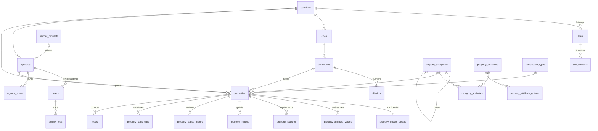

# Base de données — immobilier.abidjan.net

Fichiers : `database/schema.sql` (structure de référence v1) · `database/seed.sql` (référentiels de lancement Côte d'Ivoire).
Cible : **MySQL 8.0+ / MariaDB 10.6+**, InnoDB, `utf8mb4_unicode_ci` (collation portable MySQL ↔ MariaDB). Testé sur MySQL 8.0.40 (MAMP).

## Vue d'ensemble (37 tables)

| Domaine | Tables |
|---|---|
| Multisite & géographie | `countries`, `sites`, `site_domains`, `cities`, `communes`, `districts`, `settings` |
| Agences & comptes | `agencies`, `agency_zones`, `users`, `login_attempts`, `password_resets`, `remember_tokens` |
| Catalogue | `transaction_types`, `property_categories`, `category_transaction_types`, `attribute_groups`, `property_attributes`, `property_attribute_options`, `category_attributes`, `features` |
| Annonces | `properties`, `property_private_details`, `property_attribute_values`, `property_features`, `property_images`, `property_status_history`, `property_stats_daily` |
| Relation client | `leads`, `partner_requests`, `notifications` |
| Contenu & SEO | `pages`, `blog_posts`, `banners`, `seo_meta`, `redirects` |
| Traçabilité | `activity_logs` |

## Relations principales



## Choix de conception

1. **Une seule table `users`** pour l'équipe interne et les agences (le cahier évoquait `admin_users` et `agency_users`). Raisons : connexion unique à `/cmsadmin`, unicité des emails garantie par la base, journal et notifications reliés à un seul type de compte. La contrainte `chk_users_scope` impose la cohérence rôle ↔ pays ↔ agence (un Admin Pays a un pays, un compte agence a une agence).
2. **Rôles** : `super_admin`, `country_admin`, `agency_owner` (responsable de l'agence : profil, agents), `agency_agent`. Les permissions sont définies dans le code par rôle ; une table de permissions fines pourra être ajoutée si le besoin apparaît.
3. **Critères dynamiques — EAV hybride.**
   - Les critères sont décrits dans `property_attributes` et rattachés aux catégories via `category_attributes` (une sous-catégorie hérite des critères de sa racine et peut en ajouter). Tout se paramètre depuis le back-office.
   - Les critères **les plus filtrés** (surface habitable, superficie terrain, pièces, chambres, salles de bain) sont stockés dans des **colonnes indexées** de `properties` (`storage = 'column'`) : la recherche reste rapide sans jointures EAV. Les autres (standing, titre de propriété, viabilisation…) vont dans `property_attribute_values`.
   - Un critère à choix multiple produit une ligne par option (unicité garantie par `option_scope`).
4. **Données confidentielles isolées** dans `property_private_details` (propriétaire d'un bien de particulier, notaire, référence de dossier, notes). Les requêtes du site public ne joignent jamais cette table.
5. **Deux statuts distincts** sur une annonce : `status` (workflow de publication : `pending`, `published`, `rejected`, `unpublished`, `archived`, `expired`) et `availability` (disponibilité du bien : disponible, réservé, vendu, loué). Un rejet sans motif est refusé par la base. Chaque changement de statut est historisé dans `property_status_history`.
6. **Origine d'une annonce** (`source`) : `agency` (agence partenaire, `agency_id` obligatoire), `private_owner` (bien de particulier publié par l'admin), `platform` (bien propre).
7. **Multisite** : `site_domains` associe chaque nom d'hôte (production, staging, local) à un site ; le middleware `SiteResolver` retire le port de `HTTP_HOST` avant la recherche. Les domaines `local` ne sont acceptés qu'en `APP_ENV=local` ; un domaine `production` non principal (`is_primary = 0`, ex. `www.`) redirige en 301 vers le domaine principal ; `sites.status` : `maintenance` = site public en 503 (back-office ouvert), `disabled` = 404. Ces tables et `settings` sont mises en cache (`storage/cache/sites.php`, `CACHE_SITES_TTL`) : vider le cache après modification directe (`php bin/cache-clear.php`). Toutes les tables métier portent `country_id`.
8. **Paramètres** : `settings` avec `site_id` NULL = valeur globale, sinon surcharge par site. Les coordonnées du site affichées sur le front sont les colonnes `sites.contact_*` / `address` / `latitude` / `longitude` (éditées dans Pays & sites ; latitude et longitude, migration `0006`, placent la carte de la page Contact ; `social_links`, migration `0007`, porte les liens des réseaux sociaux en JSON — liste fermée `facebook`, `instagram`, `linkedin`, `x`, `youtube`, `tiktok`) ; les clés `contact.*` de `settings` ne sont pas utilisées. Les décisions métier en attente (taux et mode de commission, contacts du site) sont initialisées à `null`.
9. **Multilingue prêt** : libellés de référentiels en français + colonne JSON `*_translations` (`{"en": "…"}`) ; les chaînes d'interface restent dans `lang/*.php`.
10. **Prix** : `DECIMAL(15,2)` + `currency_code` copié du pays à la création (FCFA sans décimales, autres devises possibles). `price` NULL = prix sur demande ; `price_period` = total, mois, semaine, nuit, année.
11. **Statistiques** : compteurs dénormalisés sur `properties` (`views_count`, `leads_count`) + agrégats journaliers `property_stats_daily` (vues, clics téléphone / WhatsApp, partages, contacts) pour les graphiques des tableaux de bord.
12. **Hero de l'accueil** : diapositives gérées dans `banners` avec `placement = 'home_hero'` (titre, légende du lieu, image).
13. **Suppression logique** (`deleted_at`) sur `users`, `agencies`, `properties` ; les autres tables utilisent des statuts ou la suppression physique avec cascades.

## Écarts avec la liste du cahier des charges (§3)

| Cahier | Choix retenu | Motif |
|---|---|---|
| Catégorie « Terrain loti / non loti » | Critère `land_subdivision` (Loti / Non loti) sur toutes les catégories Terrains | C'est un état du terrain, pas un type : évite de dupliquer terrain nu loti / non loti, agricole loti… |
| « Bail commercial / cession de bail » | Deux types de transaction distincts | Une cession de bail se vend (prix total), un bail se loue (loyer mensuel) |
| « Terrain à vendre / à louer » | Transactions Vente / Location sur la catégorie Terrains | Même logique que les autres biens |
| Équipements et critères résidentiels | Piscine, jardin, garage, climatisation, sécurité, groupe électrogène, forage, ascenseur, fibre → `features` ; surfaces, pièces, étage, standing… → critères | Les équipements sont des cases à cocher filtrables communes à plusieurs catégories |

## Règles de gestion du catalogue et des référentiels (back-office, lot 1.4)

- **Transactions** (`category_transaction_types`) : déclarées sur les familles (catégories racines). Une sous-catégorie sans ligne reprend les transactions de sa famille ; si elle en a, elle les restreint (sous-ensemble de la famille).
- **Critères** : une sous-catégorie hérite des critères de sa famille (`category_attributes` de la racine) et ne stocke que ses critères propres.
- **Codes immuables** après création : `property_categories.code`, `property_attributes.code`, `property_attribute_options.code` (dès qu’une valeur l’utilise), `features.code`, `countries.iso2`, `sites.code`. Le `storage`/`column_name` d’un critère est fixé à la création ; son `input_type` est verrouillé dès qu’une valeur existe.
- **Suppression** : uniquement si l’élément n’est pas utilisé (annonces, agences, zones, demandes de partenariat, sous-niveaux) ; sinon désactivation (`is_active = 0`). Une option retirée d’un critère est supprimée si inutilisée, désactivée sinon. `property_features` étant en `ON DELETE CASCADE`, un équipement utilisé n’est jamais supprimé.

## Annonces et révisions (lot 1.6, migration 0002)

- **Statuts** : `properties.status` = `pending`, `published`, `rejected` (motif obligatoire, contrainte `chk_properties_rejection`), `unpublished`, `archived`, `expired` ; `availability` (disponible, réservé, vendu, loué) est indépendante. Chaque changement est historisé dans `property_status_history` (`user_id` NULL = action automatique du CRON).
- **Révisions** : `property_revisions` (`data` JSON = `fields`, `attributes`, `features`, `images`) enregistre une modification proposée par une agence sur une annonce **publiée** ; la version en ligne n'est pas touchée. Une seule révision `pending` par annonce (la suivante complète la même ligne) ; `approved` applique les données, `rejected` conserve la version en ligne, `superseded` = l'équipe a modifié directement entre-temps.
- **Photos** : `property_images.path` = chemin **sans suffixe de taille** (`uploads/ci/annonces/12/ab34…`), décliné en `-1600.webp`, `-800.webp`, `-400.webp`. `revision_id` non nul = photo proposée par une révision en attente : **les requêtes publiques filtrent `revision_id IS NULL`**. `sort_order` 0 = photo de couverture.
- **Critères** : `storage = 'column'` → colonnes indexées de `properties` (`living_area`, `land_area`, `rooms`, `bedrooms`, `bathrooms`) ; sinon `property_attribute_values` (une ligne par option cochée pour un multi-choix, unicité par `option_scope`).
- **Expiration** : `expires_at` = publication + `listing.lifetime_days` ; `expiry_reminder_sent_at` évite les relances répétées. `bin/expire-listings.php` (CRON quotidien) passe les annonces échues en `expired` et prévient l'agence.
- **Référence publique** : `reference` = `listing.reference_prefix` + `-` + (10000 + id), attribuée juste après l'insertion.

## Comptes et agences (lot 1.5)

- Compte créé par un administrateur : `password_hash` aléatoire inutilisable + `must_change_password = 1` ; l’accès s’active par le lien d’invitation (`password_resets`, 72 h). « Invitation en attente » = `must_change_password = 1` et `last_login_at` NULL.
- Suppression d’un compte : `deleted_at` + `is_active = 0` + email remplacé par `supprime-{id}-{timestamp}@invalid.local` (libère l’unicité de `uq_users_email`), jetons supprimés.
- Suppression d’une agence : logique (`deleted_at`, `status = 'closed'`) et uniquement sans annonce ; ses comptes sont supprimés logiquement. `verified_at` renseigné à la première vérification, remis à NULL si la vérification est retirée ; `is_featured` forcé à 0 hors statut `active`.
- `partner_requests` : `approved` uniquement via la création de l’agence (`agency_id`, `handled_by_user_id`, `handled_at`) ; `internal_notes` jamais visibles de l’agence.
- Logos : `agencies.logo_path` = chemin relatif à `public/` (`uploads/{iso2}/agences/{id}/logo-{aléatoire}.webp`).

## Espace agence et demandes de contact (lot 1.7)

- **Périmètre d'un compte agence** : toutes les lectures sont filtrées par `country_id` du site **et** `agency_id` du compte connecté (jamais un identifiant passé en paramètre). Une demande adressée à une autre agence répond 404.
- **`leads`** : `status` = `new` (jamais ouverte, pastille du menu), `read` (posé à la première ouverture), `in_progress`, `closed`, `spam` ; `handled_at` est renseigné en passant à `closed` ou `spam`, et remis à NULL si la demande est rouverte. `assigned_user_id` = personne chargée de répondre (équipe du pays, ou comptes de l'agence destinataire). Les types `general_contact` et `property_submission` ne concernent que l'équipe interne ; une agence ne reçoit que `property_contact` et `agency_contact`.
- **Profil d'agence** : le responsable (`agency_owner`) ne modifie que `description`, `email`, `phone`, `whatsapp`, `website`, `address`, `city_id`, `commune_id`, `logo_path` et `agency_zones` ; `name`, `slug`, `legal_name`, `rccm`, `tax_id`, `status`, `is_verified` et `is_featured` restent à l'équipe interne. L'agent (`agency_agent`) est en lecture seule. Chaque enregistrement est journalisé (`agency.profile_updated`) et notifie l'équipe du pays dans la cloche.
- **Statistiques du tableau de bord** : `property_stats_daily` (30 jours) pour l'audience et le classement des biens, compteurs `properties.views_count` / `leads_count` pour les totaux. Ces tables ne sont alimentées qu'à partir du site public (lots 1.9 et 1.10) : tant qu'aucune ligne n'existe, les écrans affichent un état vide au lieu d'une courbe à zéro.

## Site public (lot 1.8)

- **Trois règles pour toute requête publique** (`ListingRepository`) : `country_id` du site courant, `status = 'published'` et `deleted_at IS NULL`, photos filtrées par `revision_id IS NULL`. `property_private_details` n'est jamais joint.
- **Mise en avant** : une annonce `is_featured = 1` n'est « à la une » que si `featured_until` est NULL ou dans le futur ; les agences en vedette sont `agencies.is_featured = 1` et `status = 'active'`.
- **Hero de l'accueil** : `banners` avec `placement = 'home_hero'`, `is_active = 1` et période (`starts_at` / `ends_at`) courante ; sans bannière, l'accueil sert les photos provisoires livrées avec la maquette (`HomeController::FALLBACK_SLIDES`). Le CRUD des bannières arrive au lot 2.2.
- **Icônes des catégories** : `property_categories.icon` porte un nom du sprite Phosphor local (`public/assets/img/icons.svg`) ; les familles du seed ont été alignées par la migration `0003`.
- **Pages éditoriales** (`pages`) : le seed crée six pages système vides et non publiées. La migration `0004` remplit et publie « À propos » et « Comment ça marche » (textes de proposition, modifiables au lot 2.2) ; les quatre pages légales restent **non publiées** en attendant les textes du client. Une page non publiée répond 404 et son lien disparaît du pied de page — le site ne sert donc jamais de page vide. Les slugs publiés sont mis en cache (`PageRepository::publishedSlugs()`) pour déclarer une route par page : un slug de page ne doit jamais reprendre un slug de `transaction_types`, et toute écriture dans `pages` doit appeler `flush()`.
- **URL publique d'une annonce** : `/annonces/{slug}-ref{id}` (`ListingPresenter::url()`) ; le `slug` reste modifiable en back-office, l'identifiant garantit l'unicité.

## Weblogy intermédiaire exclusif (lot 2.5, migrations 0008 et 0009)

- **Comptes particuliers** : `users.role = 'owner'` (contrainte `chk_users_scope` : `agency_id` NULL, `country_id` obligatoire), `users.email_verified_at` (les comptes internes et partenaires existants sont considérés confirmés), `email_verifications` (un jeton haché par compte, remplacé à chaque envoi). Un `owner` n'accède qu'à l'espace public `/mon-espace`.
- **Annonces** : statut `draft` (brouillon privé, jamais compté dans la file de validation) et `deactivated_by_partner` (seul ce drapeau autorise le partenaire à réactiver ; toute dépublication, republication ou resoumission par l'équipe le remet à 0).
- **Partenaires** : `agencies.partner_type` (`agency`, `developer`, `property_manager`, `other`) et `legal_form` ; `partner_requests` enrichi (raison sociale, forme juridique, NCC, carte professionnelle, coordonnées de la structure, fonction du responsable, années d'activité) et `partner_request_files` (`rccm`, `identity`, `tax`, `license`, `other`).
- **Biens confiés** : `property_submissions` (description structurée, localisation dont adresse jamais publiée, prix et conditions, surfaces, pièces, `title_type` = code d'option du critère `title_type`, statut `submitted → in_review → published | rejected | withdrawn`, `property_id` de l'annonce créée par l'équipe) et `property_submission_files` (`photo` ré-encodée WebP, `document` PDF/image).
- **Fichiers** : les colonnes `path` de `partner_request_files` et `property_submission_files` sont **relatives à `storage/private`** (hors racine web) et ne sont servies que par un contrôleur qui vérifie les droits.
- **Paramètre** `workflow.auto_publish_partner` (défaut `false`).
- **Textes publics** (0009) : pages À propos, Comment ça marche, CGU, confidentialité, cookies et mentions légales réécrites ; page `faq` créée et publiée.
- **Identité légale** (0010) : mentions légales et confidentialité complétées pour Weblogy Tech S.A (forme juridique, capital, adresse postale, RCCM, NCC, directeur de la publication), par remplacements ciblés qui respectent une page retouchée dans le back-office.

## Conventions

- Tables au pluriel en `snake_case`, clés étrangères `<entité>_id`, index `idx_<table>_<usage>`, uniques `uq_…`, contraintes `chk_…`, clés étrangères `fk_…`.
- Identifiants `INT UNSIGNED` (référentiels) ou `BIGINT UNSIGNED` (volumes : annonces, valeurs, images, contacts, journaux).
- Dates en **UTC** (`DATETIME`), conversion au fuseau du pays à l'affichage. IP en `VARBINARY(16)` via `INET6_ATON()` / `INET6_NTOA()`.
- Aucun compte ni mot de passe dans `seed.sql` : le premier Super Admin est créé par le script d'installation (lot 1.3).

## Évolutions du schéma

`schema.sql` est l'**état de référence v1**. Toute modification ultérieure :
1. nouveau fichier numéroté `database/migrations/0002_<description>.sql` (puis 0003…), idempotent si possible ;
2. répercussion dans `schema.sql` pour qu'une installation neuve reste à jour ;
3. mise à jour de ce document si la modification change un choix ci-dessus.

## Installation locale (MAMP)

```bash
MYSQL=/Applications/MAMP/Library/bin/mysql80/bin/mysql
$MYSQL -uroot -proot -h127.0.0.1 -P8889 -e "CREATE DATABASE immobilier_abidjan_net CHARACTER SET utf8mb4 COLLATE utf8mb4_unicode_ci"
$MYSQL -uroot -proot -h127.0.0.1 -P8889 --default-character-set=utf8mb4 immobilier_abidjan_net < database/schema.sql
$MYSQL -uroot -proot -h127.0.0.1 -P8889 --default-character-set=utf8mb4 immobilier_abidjan_net < database/seed.sql
```

## Points à valider par le client

- **Commission** : mode (pourcentage, montant fixe, annonce premium) et taux — paramètres `commission.*` à renseigner.
- **Rémunération des propriétaires particuliers** (biens confiés) : non modélisée, à définir (lot 2.5).
- **Référentiel géographique** : la liste des quartiers est une base de départ, à relire et compléter.
- **Moteur de base en production (Plesk)** : MySQL 8 ou MariaDB (version) — le schéma est écrit pour les deux mais n'a été testé que sur MySQL 8.0.40.
